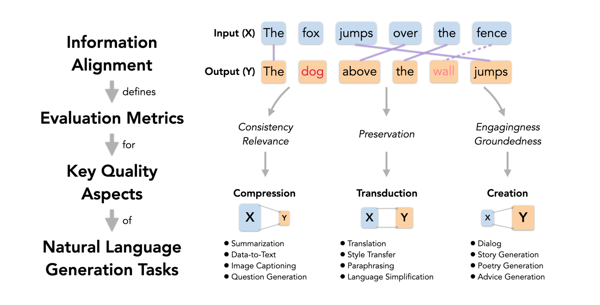

# CTC Score

This repo contains code of an automatic evaluation metric described in the paper \
**[Compression, Transduction, and Creation: A Unified Framework for Evaluating Natural Language Generation](https://arxiv.org/pdf/2109.06379.pdf)** \
Mingkai Deng*,   Bowen Tan* (equal contribution),   Zhengzhong Liu,   Eric P. Xing,   Zhiting Hu \
EMNLP 2021

## Getting Started
* Previous work on NLG evaluation has typically focused on a single task and developed individual evaluation metrics based on specific intuitions.
* In this paper, we propose a unifying perspective based on the nature of information change in NLG tasks, including compression (e.g., summarization), transduction (e.g., text rewriting), and creation (e.g., dialog).
* A common concept underlying the three broad categories is **information alignment**, which we define as the extent to which the information in one generation component is grounded in another.
* We adopt contextualized language models to measure information alignment.



*(Note: We provide the user API below. Code to reproduce paper results can be found in the [train/](train/) folder.)*

## Installation
* Python version >= 3.6

Install with pip from PYPI by
```
pip install ctc_score
```

Or install with pip from the repository by
```
git clone https://github.com/tanyuqian/ctc-gen-eval.git
cd ctc-gen-eval/
pip install -e .
```

## Usage
We provide a command line interface (CLI) of CTC score as well as a python module.

### Command Line Interface (CLI)
For the CLI, you can use it as follows:
```commandline
ctc_score 
    --task style_transfer/summarization/dialog 
    --align the_alignment_model_to_use 
    --aspect the_aspect_to_evaluate 
    --hypo a_file_with_all_hypothesized_texts_to_evaluate (line-by-line) 
    --remove_stopwords add_this_augument_to_remove_stopwords_in_aligning 
    --scores_save_path the_path_to_save_example-wise_scores 
    
    # for task=style_transfer
    --input_sent a_file_with_all_input_sentences (line-by-line)
    
    # for task=summarization
    --doc a_file_with_all_documents (line-by-line) 
    --refs a_file_with_all_references (line-by-line)
    (if each document has more than one reference, divide them by "|||")
    
    # for task=dialog
    --fact a_file_with_all_facts (line-by-line) 
    --dialog_history a_file_with_all_dialog_histories (line-by-line)
```
    
Example:
```commandline
ctc_score --task summarization \
          --align D-cnndm \
          --doc example/docs.txt \
          --refs example/refs.txt \
          --hypo example/hypos.txt \
          --aspect relevance \
          --scores_save_path scores.txt
```

We provide these information alignment models (options of `--align`):

* `E-bert`: Embedding alignment model with BERT embeddings. 
* `E-roberta`: Embedding alignment model with RoBERTa embeddings.
* `E-roberta-mnli`: Embedding alignment model with RoBERTa-MNLI embeddings. 
* `D-topical_chat` or `R-topical_chat`: Discriminative (D) or Regression (R) alignment model trained with TopicalChat dialogs.
* `D-persona_chat` or `R-persona_chat`: Discriminative (D) or Regression (R) alignment model trained with PersonaChat dialogs.
* `D-cnndm` or `R-cnndm`: Discriminative (D) or Regression (R) alignment model trained with CNN/DailyMail documents.
* `D-xsum` or `R-xsum`: Discriminative (D) or Regression (R) alignment model trained with XSUM documents.
* `D-yelp` or `R-yelp`: Discriminative (D) or Regression (R) alignment model trained with Yelp dataset.

More details of these models can be found in our [paper](https://arxiv.org/pdf/2109.06379.pdf).

### Python 
We provide three scorers: `StyleTransferScorer`, `SummarizationScorer`, and `DialogScorer`. 
They can be used like this example below (see [demo.py](demo.py) for more examples):
```python
from ctc_score import DialogScorer

# Topical-Chat
dialog_history = "so, i'm reading the latest film from studio ghibli is out the tale of princess kaguya. dunno if you're familiar with them, but studio ghibli has made a lot of great animated films, like spirited away, and princess mononoke \n i don't think i have heard of them. i have heard that one of the directors recently passed away, and his last film was nominated for an academy award \n yeah, sadly, disney ( which owns the american rights to the films ) doesn't tend to promote them very much. i think they're worried they 'll cut into their \" home grown \" market. anyway, dunno if you even like animated movies, but they're worth checking out. \n i don't watch them very often. apparently there was a showing of the recent film in a park in d.c. that's one u.s. city i haven't been to \n sadly, i haven't been to dc either, although i've always wanted to visit there. apparently there's a lot of interesting going down this summer. they're having a crab feast at the navy - marine corps stadium. they 'll have 100 gallons of crab soup! can you imagine that much soup? \n\n"
hypo = "i recently met a girl who lives in that area, and she said the nightlife is worth visiting for. it sounds like many of the events feature jazz music. do you listen to jazz very often?"
fact = "from left, emma baker, daniel saperstein and taylor mulitz of flasher will perform this summer's final fort reno concert. ( jared soares for the washington post ) monday, july 30 25th birthday celebration at national postal museum : celebrate 25 years of this institution devoted to the long history of the u.s. postal service with daytime festivities that include cupcakes, birthday postcards, a photo booth and a special scavenger hunt with prizes. 11 a.m. to 2 p.m. free. tuesday, july 31 \" the color purple \" at kennedy center : the tony award - winning musical revival, based on the pulitzer prize - winning alice walker novel of the same name, features jazz, ragtime, gospel and blues with a story about an african american woman named celie surviving poverty in the south during the 1930s. through aug. 26. $ 69-$149. ask a harry potter scholar at southeast neighborhood library : come to this talk from tolanda henderson, a librarian from george washington university, who has used the j.k. rowling book series as a text in academia. commune with other muggles who prove that it's not just kids and young adults who obsess about the boy who lived. 7 p.m. free. wednesday, aug. 1 rico nasty at the fillmore silver spring : two summers ago, rico nasty was a teenage loudmouth from the maryland suburbs, generating buzz on youtube for spitting surly, rainbow - tinted rhymes. now, after signing a deal with atlantic records, the 21-year - old singer is on her way to becoming one of the brightest voices in rap music.\n"

scorer = DialogScorer(align='D-topical_chat')

score = scorer.score(fact=fact, dialog_history=dialog_history, hypo=hypo, aspect='engagingness')
print(score)
```