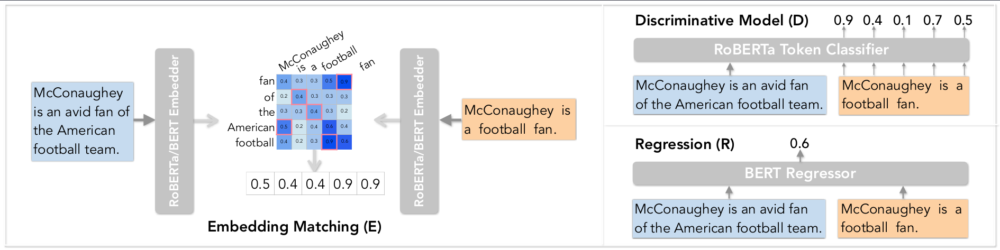

# CTC: A Unified Framework for Evaluating Natural Language Generation

This repo contains preliminary code of the following paper:
**Compression, Transduction, and Creation: A Unified Framework for Evaluating Natural Language Generation** \
Mingkai Deng∗,   Bowen Tan∗ (equal contribution),   Zhengzhong Liu,   Eric P. Xing,   Zhiting Hu \
EMNLP 2021 \
[[ArXiv]]()
[[Slides]]()

## Getting Started
* Previous work on NLG evaluation has typically focused on a single task and developed individual evaluation metrics based on specific intuitions.
* In this paper, we propose a unifying perspective based on the nature of information change in NLG tasks, including compression (e.g., summarization), transduction (e.g., text rewriting), and creation (e.g., dialog).



## Requirements

Our python version is ```3.7```. Run these commands before you start:
```
cd data/
unzip topical_chat.zip
unzip yelp.zip
```

```
pip install -r requirements.txt
python -m spacy download en
```

and remove [this line](https://github.com/pytorch/fairseq/blob/v0.10.0/fairseq/models/roberta/alignment_utils.py#L96) in Fairseq (a too strict assertion):
```python
assert torch.all(torch.abs(output.sum(dim=0) - features.sum(dim=0)) < 1e-4)
```

## Alignment Model Training

The constructed data and trained models can be directed downloaded [here](). If you want to run the process, see below.

### Data Construction
The script to construct data for our discriminative (D) and regression (R) model: [scripts/construct_data.sh](scripts/construct_data.sh). 

Constructed data will be saved in ```constructed_data/```.

### Training Discriminative Model (D)

The script to train the discriminative models: [scripts/train_discriminative.sh](scripts/train_discriminative.sh).

Checkpoints will be saved in ```ckpts/```.

### Training Discriminative Model (R)
The script to train the discriminative models: [scripts/train_regression.sh](scripts/train_regression.sh).

Checkpoints will be saved in ```xxx/```.


## Test Correlation
The script to test out alignment models: [scripts/test_correlation.sh](scripts/test_correlation.sh) (instance-level) & [scripts/test_correlation_system.sh](scripts/test_correlation_system.sh) (system-level). 

Correlation scores will be printed in the running terminal, and evaluation scores for all examples will be saved in ```eval_results/```.

## Results
All result numbers can be found in the appendix of our paper. (exactly the same numbers would be got with [our trained models]()).